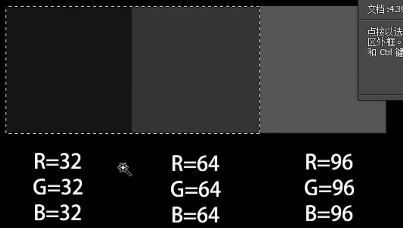

# PS基础学习
## 软件熟悉
### ps主界面
- 菜单栏
- 工具栏
- 选项栏：对工具参数进行调整
- 面板
### 新建文档
- 剪切板：将截切板中的图片尺寸读取新建
- **像素图**：
  - **像素**：是计算数码影像的一种单位。
    - 1个像素就是最小的图形的单元，在屏幕上显示的通常就是单个的染色点
- **矢量图**：
  - 矢量图：没有像素的概念，面对对象的图像或绘画图像，在数学上定义为一系列由线连接的点
- **分辨率**：分辨率的单位简称Ppi，也就是`Pixel Per lnch`，1英寸/像素
  - 72Ppi表示1英寸由72个像素点组成
  - 分辨率越大，像素越多，图像的细节就越多，也就越清楚。
  - 在尺寸固定的情况下，分辨率越大，像素越多，图像细节越多，文件体积就越大，占用资源也就越多
- **常用分辨率设置**
  - 洗印照片：300或以上
  - 杂志，名片等印刷物：300
  - 
  - 海报高清写真：96-200
  - 网络图片，网页界面：72
  - 大型喷绘：25-50
- **颜色模式**
  - RGB：是从颜色发光的原理来设计的色彩模式，有红绿蓝三种原色，就好像有红绿蓝三把手电，当他们的光相互叠合的时候，按照不同的比例混合，呈现出16777216种颜色，是广泛的用于显示屏的一种基本色彩模式
  - CMYK：是印刷色彩模式，由青色、品红、黄色、黑色油墨进行混合来表现出各种印刷颜色。因为CMYK模式是印刷色，不是发光色，所以在显示器上会表现的黯淡一些
- **白色和透明色**
  - 白色：就是全由白色像素点组成，RGB为`255 255 255`,CMYK为`0 0 0 0`
  - 透明色：就好像一张玻璃，透光，透色，没有像素点
    - 在ps中用灰白相间的网格(ctrl+k首选项可修改颜色)来表示透明，透明网格只是用于参考观察，并不会被打印或显示出来
### 图像基础知识
- **修改图像大小**：图像--图像大小
- **像素/尺寸/分辨率之间的关系**
  - `画面总像素值 = 宽度像素值 * 高度像素值`
  - `画面总像素值 = 高(英寸) * 宽(英寸) * 分辨率(像素/英寸)²`
- **PPI/DPI/LPI**
  - Dpi：点分辨率（Dot Per lnch）,衡量输出精度的主要参数
    - 打印机产生的每英寸的油墨点数，或者显示输出设备的每英寸的显像点数
    - 打印高DPI需要高PPI和高级纸张
      - 打印机的dpi越高，打印的图像就越精细，但也受两个因素的影响，一个是图片自身的分辨率要足够高，二是纸张的质量要足够好，能够承受那么密集的墨点
      - 如果用普通的纸张，高dpi，墨点过密，会导致油墨粘连泛滥
    - 常见的屏幕物理DPI多为96
  - LPI：线分辨率，是挂网的精度指标，即印刷图像所用的网屏的每英寸的网线数
    - 挂网的网线越多则表示网点越密集，印刷品的层次就更细腻和丰富
    - 不同纸张设定不同LPI
    - PPI一般为LPI的两倍

### 图像格式
- PSD：psd是photoshop的标准文件格式，包含颜色、图层、通道、路径、动画等信息，是创作图像作品的原始文件；
  - 另外还有一种PSB文件，支持PSD所有功能。并且支持高或宽达到300000像素的超大文件，PSB属于新格式，只能由CS或更高版本打开
- JPG：jpg是最流行的图片文件格式，体积小巧、可变压缩比、支持交错，广泛用于互联网传输，是最常见的图片格式；
- GIF：gif图片支持透明色、支持动画，我们在网页上看到的动态图、聊天表情大都是GIF图片。

### PS设置
- 暂存盘：PS在工作的时候会产生一个临时文件，因为软件在运算的过程中会产生大量的数据，而内存是装不下的，所以要把数据暂时存在硬盘空间上，
  - 位置：**编辑--首选项--常规--暂存盘**，快捷键 **ctrl + k**
- 历史记录设置
- 自动保存设置：**ctrl + k** -- 文件管理，设置**自动存储恢复信息时间间隔**
- 快捷键设置：**编辑--键盘快捷键**，自定义快捷键，保存自定义的快捷键，可以在其它电脑放入相应位置来使用
### 图层面板
- **常见图层分类**
  - 普通图层
  - 背景图层
  - 智能对象图层
  - 调整图层
  - 填充图层
  - 视频图层
  - 矢量图层
  - 3D图层
  - 文字图层
- **图层基本操作**
  - **隐藏**
    - 图层隐藏后，存jpg或其他最终格式的图像的时候，隐藏图层是不显示的；
    - `alt + 左键`:隐藏/恢复选中之外的所有图层
  - **图层次序**
    - 可以拖拽图层改变图层的上下次序，随之画面上的叠加次序也就发生变化；
    - 快捷键`ctrl + [/]`：向下/上移动一层
    - 快捷键`ctrl + shift + [/]`：直接移动到最下/最上一层
  - **复制图层**
    - 鼠标放到要复制的图层上，右键--复制图层
      - 文档选择其他文件或新建，可以将图层复制到其他文件中
    - 快捷键：按住`alt`，点击鼠标左键拖动复制，可以选中多个复制
    - 快捷键`ctrl + j`：复制图层，并且复制的图层位于原图层上方
  - **删除图层**
    - 快捷键`delete`
  - **图层编组**
    - 选中要编组的图层，`ctrl + G`编组
- **图层面板设置**：面板选项，设置缩略图大小，缩略图内容等等

## 工具学习
### 抓手工具
- 抓手工具：用于拖动图像以查看
  - 快捷键：`H`
  - 图标：小手
  - 菜单栏：
    - 滚动所有窗口：勾选后，拖动一张图，其他图也跟随拖动
      - 窗口--排列--关联，将多张图关联，才能看出效果
  - **重要**：在任何工具使用时，按住**空格键**不松，切换为抓手工具，松开切回所使用的工具
- 旋转视图工具：用于旋转图像
  - 快捷键：`R`
  - 图标：小手（长按或右键点击）
### 缩放工具
- 缩放工具：对图像进行缩放
  - 快捷键：
  - 图标：放大镜
  - 菜单栏：
    - 调整窗口大小以满屏显示：图像窗口浮动时，勾选，缩小和放大时，窗口随之适应
    - 细微缩放：可通过长按鼠标并移动进行缩放
  - **重要**：任何工具使用时都可以通过`alt + 滚轮`快捷缩放图像
### 移动工具
- 移动工具：移动图像
  - **快捷键**：`V`
  - **图标**：十字
  - **图层移动的使用**：
    - 复制到鼠标指定位置：直接将某图层拖到其他文件指定位置
    - 复制且位置不变：拖动到新文件后，按住`shift`，松开鼠标
      - 新文件和源文件大小需要一样，不然会自动跑到图像中央或选区中央
  - **菜单栏**：
    - **自动选择图层/组**：勾选后，鼠标点击哪个就移动哪个图层/组（自动选择图层），否则只能移动当前选中的图层/组
      - 移动工具状态下，按住`ctrl键`可以快速切换自动选择模式
    - **显示变换控件**：勾选后，就能对图层对象进行变换
    - **对齐和分布**：对齐和分布是针对图层来操作的。
      - 2个及2个以上图层才能对齐操作
      - 3个及3个以上图层才能分布操作
      - **对齐**：
        - **顶对齐**：以画面最上方的图层的顶线为基准的对齐
        - **垂直居中对齐**：以图层垂直方向的中心点进行对齐
        - **底对齐**：以画面最下方的图层的底线为基准对齐
        - **左/右对齐**：以画面最左/右边图层的左边线为基准对齐
        - **水平对齐**：以图层的水平中心点为基准对齐
      - 默认情况下，目标侧的图层固定，其他图层移动找齐，将图层链接后，就会以选中的图层为基准对齐
      - **分布**：
        - **左/右分布**：以每个图层的左/右边线为基准均匀分布，即每个图层的左/右边线之间的距离都是一样的
        - **水平居中分布**：以图层水平中心点为基准均匀分布，即每个图层的中心线（竖线）之间的距离都是一样的
        - **垂直居中分布**：以图层垂直中心点为基准均匀分布，即每个图层的垂直线（横线线）之间的距离都是一样的
  - **重要**：
    - 任何工具(除钢笔工具)使用时都可以通过按下`ctrl`键切换移动工具
    - 移动工具状态下，按住`alt`键可以复制选中的图层
    - 移动工具状态下，按住`shift`键水平或垂直的移动图层
    - 移动工具状态下，方向键微小移动，`shift`加方向键加速移动
    - 移动工具状态下，`方向键`+`alt`键，也可以复制，加上`shift`键距离远一些
### 选区和选框工具
- **选区的概念**：
  - 在进行图像的编辑时，要对图层中某部分的像素进行处理，要把这部分单独选择出来，这个部分就叫做选区；
  - 在PS中，选区表现为一个封闭的游动虚线区域，因为看上去像是一圈爬动的蚂蚁，俗称为**蚂蚁线**，虚线空间以内是我们选择的区域，以外就是受保护的区域是无法进行编辑的。
- **矩形选框工具**
  - **快捷键**：`M`
  - **图标**：虚线矩形
  - **建立矩形选区**
    - 按住鼠标左键，拖动出矩形创建矩形选区；
    - 形按住鼠标左键，拖动出矩形，再按住`shift`键，创建正方形选区；
    - 按住`alt`键，再按住鼠标左键，拖动出矩形，从中心点建立选矩形区；
    - 按住`alt + shift`键，再按住鼠标左键，拖动出矩形，从中心点建立正方形选区；
- **椭圆选框工具**
  - **锯齿**：因为图像是以像素存在的，像素是正方形的，所以椭圆选框由于边将正方形像素切开，形成锯齿；而矩形选框则不存在
  - **消除锯齿**：不选择消除锯齿，图像边缘会有锯齿（可以放大看到），勾选则会变得柔和
- **单行选框和竖行选框工具**
  - **单行选框工具**：特殊的矩形选框，高度只有1个像素（放大可以看到）
  - **单列选框工具**：特殊的矩形选框，宽度只有1个像素
  - 单行和单列选区是可以羽化的，羽化后，选区不可见，但仍然存在（可填充颜色观察）
    - 羽化时，会弹出警告框：任何像素都不大于50%的选择。选区边将不可见。
- **选区的基本操作**
    - 使用任何工具时，鼠标进入选区都会变成白箭头，可以移动选区，只是移动选区，对图像不会有任何改变，要选区内的图像，需要使用移动工具
    - `ctrl + d`取消选区，`ctrl + shift + d`重新选择取消掉的选区
    - `ctrl + h`隐藏蚂蚁线，选区仍然是存在的
    - **反向选区：建立选区后，鼠标右键--选择反向
- **选区保存和载入**
  - 选区是暂时性的，只有保存选区后才能被存储到PSD文件中
    - 如果没有保存选区，只保存了文件，关闭文件后，选区就没有了
  - 保存选区
    - 画好选区后，画布上右键鼠标--存储选区--取名--确定
    - 保存选区后，即便关闭了文件，打开后仍然能载入保存的选区
    - 在右下角的通道面板可以找到保存的选区
  - 载入保存的选区
    - 画布上右键鼠标--载入选区--通道选择自己保存的名字--确定
- **菜单栏**
  - **新选区**：创建一个选区后，再创建一个选区，上一个选区消失。每次都只保留新选区，丢弃旧选区；
  - **添加到选区**：新旧选区共存，并且如果新旧选区有交集部分，会合并到一起；
    - 在新选区模式下，按住`shift`键切换到添加到选区
  - **从选区减去**：减去选区的被框选部分；
    - 在新选区模式下，按住`alt`键切换到从选区减去
  - **与选区交叉**：只保留新选区和就选区交集部分。
    - 在新选取模式下，按住`shift + alt`键切换到与选区交叉
  - **羽化**：羽化就是选区边缘部分实现过渡式虚化，从而起到渐变的作用，从而达到选区内外自然衔接的效果，
    - 羽化使边缘柔和过渡，羽化的单位是像素，羽化值的大小决定虚化程度
    - 可以先设定羽化值，再画选区；也可以先做选区，再羽化`选择--修改--羽化`中修改羽化值，快捷键`shift + F6`
  - **消除锯齿**：矩形选区不存在锯齿
  - **样式**
    - **正常**：在正常模式下，可以自由的画立选区；
    - **固定比例**：输入宽度和高度，锁定宽高比，无论怎么画，选区的宽高比都是固定的；
      - 比例互换：宽高互换
    - **固定大小**：输入宽度和高度，锁定大小，固定选区大小。
  - **调整边缘(选择并遮住)**：调整边缘必须要有选区存在，

### 套索与魔法工具
#### 套索工具
- **套索与魔法工具的作用**：做出不规则的选区，以及根据图像的轮廓边缘智能的快速的建立选区。
- **套索工具**：套索工具也叫自由套索工具
  - **快捷键**：`L`
  - **图标**：圆圈
  - **用法**：点击鼠标左键，拖动鼠标画出轨迹来建立选区，首尾会自动连接闭合
    - 套索工具灵活快速但不够准确
  - 套索工具的菜单栏使用和选区的几乎一样
- **多边形套索工具**
  - 用法：点击画面的关键的点，来直线连接
  - 可以通过`Backspac`键或`Delete`键，来删除上一个关键点
  - 首尾交接快捷方式，双击，按住ctrl左击，或者回车
  - 多边形套索工具可以画到文档的外面，而自由套索则不行
  - **套索工具和多边形套索工具可以按着alt键相互切换**
  - 多边形套索适合于选区直线边缘
- **磁性套索工具**
  - 磁性套索工具的控点可以只能识别像素边缘，只需要移动鼠标（也可以点击），就可以自动识别像素边缘
  - 磁性套索工具可以通过`alt`键，与多边形套索工具快速切换
  - **菜单栏**
    - **宽度**：宽度的大小控制识别的范围，设的值越大，鼠标距离图像很远，也依然可以识别到，值小，则需要鼠标离图像足够近，才能识别像素边缘
    - **对比度**：高对比度适合清晰边缘，低对比度适合模糊边缘
    - **频率**：调节磁性控点的多少
#### 魔棒工具
- **魔棒工具的作用**：可以快速的将颜色相近的区域变成选区
- **快捷键**：`W`
- **图标**：魔法棒
- **菜单栏**
  - **取样大小**
    - 取样点：取样点以单像素色彩信息取样
    - 3x3平均点：相近的9个点的色彩平均值作为取样颜色
    - ...
  - **容差**：容差越大识别范围就越大，反之就越小。范围0-255
    - 容差的计算方法：
      - 
      - 如果容差选为32，那么选中最左边的图像时，左边和中间的都会变为取样选区，容差改为31的话，就只能选中一个；容差改为64，选中其中一个，则全部都会选取
  - **连续**：勾选连续只能选区互为相邻的相似像素，取消勾选会选区图像中所有相似的像素
  - **对图层取样**：勾选，可以选择没有选中图层的颜色，取消勾选，只能选择当前选中的图层的颜色
#### 快速选择工具
- **菜单栏**
  - **画笔拾取器（画笔选项）**：包含大小，硬度，间距，港币压力
    - 画笔的大小代表识别的范围
    - 硬度是边缘的识别能力
    - 间距是识别的连贯程度
  - **自动增强**：勾选，识别边缘的能力就更强
  - **调整边缘**：调整边缘可以优化选区，通过调整**平滑，羽化，对比度，移动边缘**是的选区更加的完善

### 选区的编辑方法
- **移动选区**
  - 鼠标进入选区变为白箭头后，可以移动选区；
  - 选区可以跨文档移动，移动到另一文档时，按住`shift`松开鼠标左键，可以保持选区原来的位置不变
    - 需要两个文档大小一样，不一样时会跑到文档中间，如果目标文档有选区，会自动跑到选区中央
- **选区的自由变换**
  - 制作好选区后，`右键--变换选区`，选区四周出现控杆控点，通过拖动控点，对选区进行变换。右键有很多选项
- **反向命令**
  - 创建好选区后，`右键--选择反向`，则可以选择选区之外的图像；快捷键`ctrl + shift I`
- **羽化**
  - 羽化可以制作出边缘比较柔和的选区；
  - 可以先在菜单栏设置羽化值，在创建选区；
  - 也可以先创建选区，然后`右键--羽化`，设置选区羽化值；快捷键`shift + F6`
  - 羽化使选区内透明度值向外递减；
- **选区的透明度**
  - 通过填充颜色，来看出两个选区透明度的差别
  - 制作半透明选区：
    - 新建一个图层--编辑--填充蓝色
    - 创建一个矩形选区--`alt + del`快捷填充前景色(可以多次填充)
      - 此时矩形选区内为全白色
      - 填充背景色`ctrl + del`
    - 打开右下角通道面板--创建新通道
    - 通道里制作一个选区--右键--填充
    - 内容选择前景色(白色)--不透明度60--确定
    - `ctrl + D`取消选区--点击右下角：将通道作为选区载入
    - 点击图层面板--选择图层--`alt + del`快捷填充前景色(白色)
    - 对比两个选区，明显看到通道制作的选区透过了下面的蓝色背景
  - 注：
    - 在通道中做的是选区的透明度，此选区移到哪，那就为透明；
    - 在图层中做的是选区内颜色的透明度，只是选区内那一块地方颜色改变。
      - 如：如图层选区内颜色为填充30%的透明的红色，则次红色变为半透明红色，依然是红色，不能透出下面的背景。
- **低于50%的选区**
  - 像素不大于50%选区，选区边将不可见（蚂蚁线不可见），但选区是存在的，可通过填充颜色查看
  - 用多边形套索新建一个选区，`右键-羽化`50%，填充前景色`alt + del`
    - 此时透明度高于50%的像素的在蚂蚁线里面，低于50的在蚂蚁线外面

- **扩大选区**
  - 魔棒工具建立选区后，`右键-扩大选区`可以扩大选区
- **选取相似**
- 还没写

